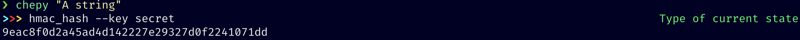
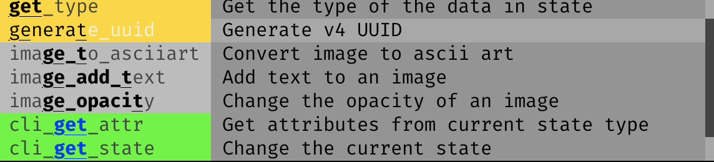

# How to use Chepy

## Concept
Chepy shares the same concept of stacking as Cyberchef. This means different methods can be chained together or stack together like Cyberchef. This concept applies to both the CLI and the python library. Chepy does offer some [extras](./extras.md) which are not part of the overall Chepy library, but offers handy functionalities. These functionalities are often data generators which cannot really be chained with other methods.

Just like Cyberchef, Chepy is only capable of working with the data that it is provided. What this means is that we cannot give Chepy a bytearray and then try to convert that to upper case. It will throw an error.

### Library vs CLI
It is important to keep in mind that Chevy was developed first to be a Python library, and then the CLI was added. There are some functions that are different between the two. It employees a very unique and dynamic CLI implementation. The CLI is self generating and offers autocompletion and built in help. The CLI itself instantiates the Chepy class as a user would when they are using it like a library. 

Lets take a look at a quick example. Lets get the HMAC hash of a string. The `hmac_hash` method in Chepy takes one required argument `key`. In python code, we would do:

```python
>>> from chepy import Chepy
>>> print(Chepy("A string").hmac_hash(key="secret").o)
9eac8f0d2a45ad4d142227e29327d0f2241071dd
```

In the CLI, we would execute the same thing as:


Notice how both the implementation are very similar. At anytime in the cli, we can type `--` to see if the preceding option takes any required or optional arguments. 

See more [examples here('./examples.md)

## Verbs
Throughout the documentation, and while using the libraries and cli, you will come across certain words. This section will describe what those words mean as they are important. 

- **state** Every time a method is called on Chepy, the data has to be stored somewhere for the following methods to be able to access it and use it. This is why almost all methods in Chepy return _self_. **state** is the attribute where this data is stored. When developing a plugin for Chepy, all methods should save the final to state before returning self.
- **states** Because Chepy library and cli both works with multiple inputs, the main Chepy class is instantiated with _*args_. Each arg is its own state. You can think of states as tabs in Cyberchef or a browser. Each one is independent of each other.
- **buffers** Because the `state` attribute is always overwritten, we can save the current state in **buffers**. This is similar to vi buffers. We can always load data from a buffer into the current state. 

## Input methods
The Chepy class in the library, and `nargs` in the cli both take ***args**. This means anything that is used to instantiate the main Chepy class are considered strings. A file path, a url, all are treated as strings. 

Example:
```python
from chepy import Chepy

c = Chepy("some string", "https://google.com")
```
In this example, both `some string` and `https://google.com` are treated as strings. In this case, Chepy has created two states. State index 0 holds `some string`, and state index 1 holds `https://google.com`. There are some helpful methods that we can use to manipulate our data. 

#### [read_file](./chepy.html#chepy.Chepy.read_file) / [load_file]((./chepy.html#chepy.Chepy.load_file))
Either of these methods can be used to load a file info chepy. These methods load the content of a file (works with binary files also) and saves them to the buffer.
```python
c = Chepy("/path/to/some/file.txt").read_file()
```

```eval_rst
.. warning::
    Chepy will read the entire file to memory, so working with very large files will really slow things down.
```

#### [load_dir](./chepy.html#chepy.Chepy.load_dir)
The `load_dir` method is used to load the entire contents of a directory into Chepy. This method optionally takes a pattern argument to specify which files to load. A state is created for each file that matches the pattern in the directory. To load recursively, the pattern `**/*` can be used.
```python
c = Chepy("/path/to/dir").load_dir("*.txt")
```
Now we can combine [read_file](./chepy.html#chepy.Chepy.read_file) and [change_state](./chepy.html#chepy.Chepy.change_state) independently to load whichever file we want into Chepy.

#### [http_request](./chepy.html#chepy.Chepy.http_request)
The last way to load data into Chepy is by making an http request. This is a binder to the requests library, and supports most http request methods, with the option to set headers, cookies, body payload etc. A dictionary of the responses body, headers and cookies are saved in the state by default.
```python
c = Chepy("https://google.com").http_request().get_by_key("body")
```

## Library
The main class for for Chepy is `Chepy`. 
```python
from chepy import Chepy
```
The [Chepy](./chepy.md) class offers all the chainable / stackable methods in one class. Refer to the docs and [examples](./examples.md) for more use cases. 

Individual modules can also be imported from Chepy. They provided slightly limited functionality, but are tied together. For example, if we only want to use the image processing methods from Chepy, we can do 
```python
from chepy.modules.multimedia import Multimedia
```

The library does provide some extra functionality also which are not accessed by the Chepy class. These [extras](./extras.md) are documented. 

## CLI
The Chepy cli is accessed by the `chepy` command which is set to path during the setup process. The cli has all the methods available in the Chepy class, but has some cli specific methods also. The cli autocompletion is color coded to indicate their functionality. Some methods take either required or optional arguments in the cli. These are also auto populated, and this can be seen by using `--`. 

- **default** Default methods does not have any background color
- **green** Green methods are only available as part of the cli. These methods always start with `cli_`. These methods also do not change the state.
- **yellow** These methods will return the current value of the cli, and can no longer be chained. 



## Output methods
Because most methods in Chepy returns self, if you run `type` on an output, you will see it is a Chepy object. To get the value out of the state, we can use a few many methods and attributes.
- **o** This is an attribute 
- **output** This is the same as o
```python
>>> Chepy("A").to_hex().o
"41"
>>> Chepy("A").to_hex().out
"41"
```
- **out** This is a method that will get the current value from state. Same as `o` and `output`.
```python
>>> Chepy("A").to_hex().out
"41"
```
- **copy** This method will copy the current value of state into the clipboard. For linux, it will require either `xsel` or `xclip`
```python
>>> Chepy("A").to_hex().copy()
```
- **web** Open the current Chepy state in Cyberchef itself. This will launch the default browser and put the current state in it.
```python
>>> Chepy("A").to_hex().web()
```
- **write** The `write` and the `write_to_file` methods will write the state data to a file. These two methods take an optional argument `as_binary` which can be set to `True` to write as a binary file. A complimentary method `write_binary` is also available which will write directly as binary. 

## States and Buffers
#### States
Think of states as tabs in your browser. Best way to understand states is by following this simple example code.
```python
>>> c = Chepy("AA", "BB")
"AA"
```
Currently we have two states, one containing AA and the other containing BB. By default, the 0 index state is loaded which contains AA
```python
>>> c.to_hex()
"4141"
```
We call the `to_hex` method on the current state. Now state index 0 is `4141`.
```python
c.change_state(1)
"BB"
```
Now we are switching to the state and index 1 which contains BB
```python
c.to_hex()
"4242"
```

#### Buffers
Buffers are very similar to states with some key differences. 
- States change every time a method is called, but a buffer never changes.
- States are automatically created, but buffers are not. 
- Data can be saved in a buffer, and loaded into a state from a buffer.

Lets see an example:
```python
c = Chepy("A").save_buffer()
```
Now the state contains an `A` and the buffer contains an `A`
```python
c.str_to_hex()
```
Now the state contains `41` while the buffer still contains `A`

### Recipes
Chepy has the concept of recipes which means it can load an run chepy methods from a JSON file. This makes sharing Chepy recipes very easy and prevents code reuse. 

Some caveats to recipes are that they do not include some of the methods from `ChepyCore`. For instance, a recipe cannot write to file, or load or read recipes. Chepy plugins does support recipes also. 

Recipes do not support the following operations:
- `fork`

If these operations are present on the instance, the recipe will not work. 

There are two main methods that handle recipes and they are both part of the Core. 

#### save_recipe
This method is used to save a recipe. This method is also chainable with other methods.

Example:
```python
from chepy import Chepy

c = (
    Chepy("tests/files/encoding")
    .load_file()
    .reverse()
    .rot_13()
    .from_base64()
    .from_base32()
    .hexdump_to_str()
    .save_recipe('/tmp/a.recipe')
)
```
This code will create the follow JSON recipe:
```json
[{"function":"load_file","args":{}},{"function":"reverse","args":{"count":1}},{"function":"rot_13","args":{}},{"function":"from_base64","args":{"custom":null}},{"function":"from_base32","args":{}},{"function":"hexdump_to_str","args":{}}]
```

#### load_recipe
This method will load a recipe file, and then run the recipe on it. So based of the previous example, instead of running the whole code, we can simply use:
```python
from chepy import Chepy

Chepy('tests/files/encoding').load_recipe('/tmp/a.recipe')
```
